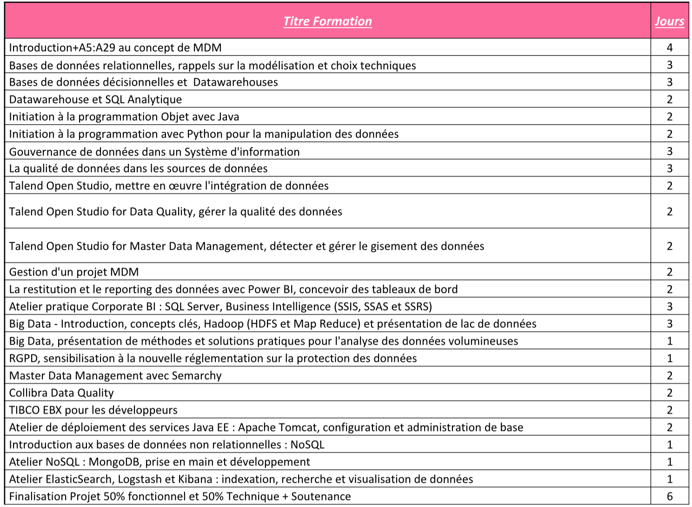

# Liste des Formations

```{r, echo=FALSE, message=FALSE}
my_tbl <- tibble::tribble(
  ~"Liste de Formations", ~Jours,
"Introduction+A5:A29 au concept de MDM", 4,
"Bases de données relationnelles, rappels sur la modélisation et choix techniques" , 3,
"Bases de données décisionnelles et  Datawarehouses", 3, 
"Datawarehouse et SQL Analytique", 2, 
"Initiation à la programmation Objet avec Java", 2, 
"Initiation à la programmation avec Python pour la manipulation des données",2, 
"Gouvernance de données dans un Système d'information", 3,
"[La qualité de données dans les sources de données](https://kmezhoud.github.io/Training/dataquality.html#dataquality)", 3, 
"Talend Open Studio, mettre en œuvre l'intégration de données", 2,  
"Talend Open Studio pour Data Quality, gérer la qualité des données", 2,

"Talend Open Studio for Master Data Management, détecter et gérer le gisement des données", 2,
"Gestion d'un projet MDM ", 2,
"La restitution et le reporting des données avec Power BI, concevoir des tableaux de bord", 2,
"Atelier pratique Corporate BI : SQL Server, Business Intelligence (SSIS, SSAS et SSRS)",3,
"Big Data - Introduction, concepts clés, Hadoop (HDFS et Map Reduce) et présentation de lac de données", 3, 
"[Big Data, présentation de méthodes et solutions pratiques pour l'analyse des données volumineuses]()", 1,  
"RGPD, sensibilisation à la nouvelle réglementation sur la protection des données", 1,
"Master Data Management avec Semarchy", 2, 
"Collibra Data Quality", 2, 
"TIBCO EBX pour les développeurs", 2, 
"Atelier de déploiement des services Java EE : Apache Tomcat, configuration et administration de base", 2, 
"Introduction aux bases de données non relationnelles : NoSQL", 2,
"Atelier NoSQL : MongoDB, prise en main et développement", 1, 
"Atelier ElasticSearch, Logstash et Kibana : indexation, recherche et visualisation de données", 1,
"Finalisation Projet 50% fonctionnel et 50% Technique + Soutenance", 6

  )

require(knitr)
require(kableExtra)
kable_styling(
              kable(my_tbl, digits = 3, row.names = FALSE, align = "l",
              caption = NULL, format = "html"),
        bootstrap_options = c("striped", "hover", "condensed"),
        position = "center", full_width = FALSE) 

```


<!--  -->


<!-- All chapters start with a first-level heading followed by your chapter title, like the line above. There should be only one first-level heading (`#`) per .Rmd file. -->

<!-- ## A section -->

<!-- All chapter sections start with a second-level (`##`) or higher heading followed by your section title, like the sections above and below here. You can have as many as you want within a chapter. -->

<!-- ### An unnumbered section {-} -->

<!-- Chapters and sections are numbered by default. To un-number a heading, add a `{.unnumbered}` or the shorter `{-}` at the end of the heading, like in this section. -->
